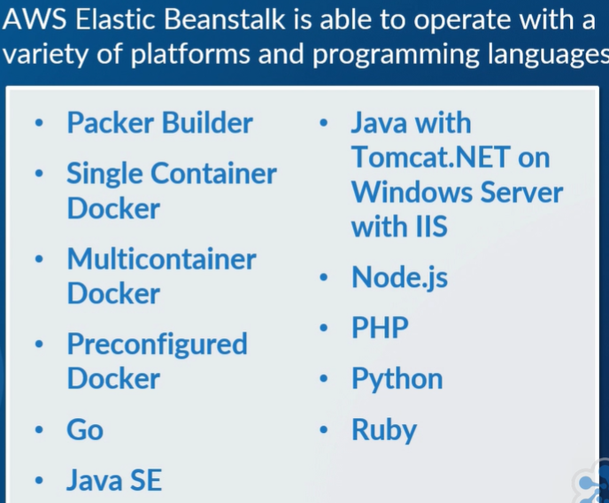

# Initial page

### TODO: Generate Json file to feed the exam training app

### walkthrough[`https://dev.to/katieraby/how-to-pass-the-aws-certified-cloud-practitioner-exam-in-2020-3d31`](https://dev.to/katieraby/how-to-pass-the-aws-certified-cloud-practitioner-exam-in-2020-3d31)

### Other repositories[`https://github.com/yafeunteun/aws-cloud-practitioner-certification-notes`](https://github.com/yafeunteun/aws-cloud-practitioner-certification-notes)[`https://gist.github.com/sheilnaik/2b2a7f8b26b74099a783d7694350a05e`](https://gist.github.com/sheilnaik/2b2a7f8b26b74099a783d7694350a05e)\`\`

### 1\) Around the World with AWS

#### Region

* Geographic area consisting of 2 or more availability zones

#### Availability Zone

* A data center

#### Edge Location

* CDN Endpoints for CloudFront
* Many more edge locations than regions

### 2\) ECS - Elastic Container Service

Docker or AWS Fargate 

Each Instance in a cluster will have a Docker Deamon and an ECS agent

### 3\) ECR - Elastic Container Registry 

Store and manage your docker images

To begin the authorisation process to communicate your docker client with your default registry :  
`aws ecr get-login --region <region> --no-include-email`

use the output of the previous command with the following  
docker login command will produce an authorisation token used within the registry for 12 hours`docker login -u AWS -p <password> https://<aws_account_ID>.dkr.ecr.region.amazonaws.com`

Policies associated to ECR:  
AmazonEC2ContainerRegistryFullAccess  
AmazonEC2ContainerRegistryPowerUser  
AmazonEC2ContainerRegistryReadOnly

MAke sure in the policy to add a 'principal' in the policy to provide access to the ECR and 'ecr:GetAuthorizationToken' API call

Use push/pull command to store/retrieve your docker images

### 4\) EKS -  Elastic Container Service for Kubernetes

Master plane vs worker nodes

1. Create an EKS Service Role: Before you begin working with EKS you need to configure and create am IAM service-role that allows EKS to provision and configure specific resources.  This role only needs to be created once and can be used for all other EKS clusters created going forward. The role needs to have the following permissions policies attached to the role: **AmazonEKSServicePolicy** and **AmazonEKSClusterPolicy**
2. Create an EKS Cluster VPC: Using AWS CloudFormation you need to create a and run a CloudFormation stack based on the following template: https://amazon-eks.s3-us-west-2.amazonaws.com/cloudformation/2019-02-11/amazon-eks-vpc-sample.yaml which will configure a new VPC for you to use with EKS
3. Install **kubectl** and the **AWS-IAM-Authenticator**: 
4. Create your EKS Cluster: Using the EKS console you can now create your EKS cluster using the details and information from the VPC created in step 1 and 2
5. Configure kubectl for EKS: Using the `update-kubeconfig` command via the AWS CLI you need to create a kubeconfig file for your EKS cluster
6. Provision and configure Worker Nodes: Once your EKS cluster shows an ‘Active’ status you can launch your worker nodes using CloudFormation based on the following template: https://amazon-eks.s3-us-west-2.amazonaws.com/cloudformation/2019-02-11/amazon-eks-nodegroup.yaml
7. Configure the Worker Node to join the EKS Cluster: Using a configuration map downloaded here:

curl -O [https://amazon-eks.s3-us-west-2.amazonaws.com/cloudformation/2019-02-11/aws-auth-cm.yaml](https://amazon-eks.s3-us-west-2.amazonaws.com/cloudformation/2019-02-11/aws-auth-cm.yaml)

You must edit it and Replace the &lt;ARN of instance role \(not instance profile\)&gt; with the NodeInstanceRole value from step 6

You EKS Cluster and worker nodes are now configured ready for your to deploy your applications with Kubernetes.

### 5\) AWS Elastic Beanstalk

AWS Elastic Beanstalk is an AWS managed service that allows you to upload the code of your web application, along with the environment configurations, which will then allow Elastic Beanstalk to automatically provision and deploy the appropriate and necessary resources required within AWS to make the web application operational. These resources can include other AWS services and features, such as EC2, Auto Scaling, application health-monitoring, and Elastic Load Balancing, in addition to capacity provisioning. This automation and simplification makes it an ideal service for engineers who may not have the familiarity or the necessary skills within AWS to deploy, provision, monitor, and scale the correct environment themselves to run the developed applications. Instead, this responsibility is passed on to AWS Elastic Beanstalk to deploy the correct infrastructure to run the uploaded code. This provides a simple, effective, and quick solution to deploying your web application.

If the application manages and handles HTTP requests, then the app will be run in a web server environment. If the application does not process HTTP requests, and instead perhaps pulls data from an SQS queue, then it would run in a worker environment.

### 6\) AWS Lambda

Firstly, AWS Lambda needs to be aware of your code that you need run so you can either upload this code to AWS Lambda, or write it within the code editor that Lambda provides. Currently, AWS Lambda supports Notebook.js, JavaScript, Python, Java, Java 8 compatible, C\#, .NET Core, Go, and also Ruby. It's worth mentioning that the code that you write or upload can also include other libraries. Once your code is within Lambda, you need to configure Lambda functions to execute your code upon specific triggers from supported event sources, such as S3. As an example, a Lambda function can be triggered when an S3 event occurs, such as an object being uploaded to an S3 bucket. Once the specific trigger is initiated during the normal operations of AWS, AWS Lambda will run your code, as per your Lambda function, using only the required compute power as defined. AWS records the compute time in milliseconds and the quantity of Lambda functions run to ascertain the cost of the service.

Lambda function =&gt; your own code  
Event sources =&gt; aws service can be use to trigger a function  
Trigger  
Downstream resources  
Log Stream

### 7\) AWS Batch

For use of vast amount of compute power in a cluster of resources

### 8\) Amazon Lightsail

for small businesses or single users

### 9\) S3

5TB as max storage

There are a number of different storage classes within S3, all of which offer different performance features and costs. And it's down to you to select the storage class that you require for the data. These classes are as follows.   
Standard,   
Standard Infrequent Access,   
Intelligent Tiering,   
One Zone Infrequent Access,   
Reduced Redundancy =&gt; But this Reduced Redundancy option is no longer recommended by AWS

### 10\) Amazon Glacier

Long term storage, there is a cost associated to retrieve data

Vault and Archive type of storage \(only vault is available from the web console\)

### 11\) EC2 instance storage

Local storage from the EC2 instance - \(ephemeral storage\)

Ideal as cache or buffer

### 12\) Amazon Elastic Block Store \(EBS\)

Can only be attached to one EC2 instance

Persistent against stopping and deletion of the EC2 instance

Can create a new volume from a snapshot

### 13\) Amazon Elastic File System

Shared file system - only compatible with NFS \(windows not supported\)

### 14\) Amazon Cloudfront

Content Delivery Network \(CDN\)

### 15\) AWS Storage Gateway

File, Volume and tape gateway from on premises storage to AWS services

can be used as a backup storage for on premises backup

### 16\) AWS Snowball

Securely transfer petabytes of data in and out of AWS

snowball is resistant to dust water and tampering

HIPAA compliant

Use of shipping devices via inked marked devices

### 17\) VPC

5 VPC  / region max

5 address are reserved in private networks example with 10.0.1.0/24:  
10.0.1.0  
10.0.1.1 -&gt; AWS routing  
10.0.1.2 -&gt; AWS DNS  
10.0.1.3 -&gt; AWS future  
10.0.1.255

### 18\) Exam Question

\#5AWS General

What does AWS design concept of "loose coupling" mean?To automate system recovery processes**B**To design a system that minimizes interdependencies**C**To break large data processing tasks into several small, separate tasks**D**To provide an identity only enough access to complete its assigned tasks

**Explanation**

Loose coupling means that complex applications should be broken down into small, loosely coupled components with as few interdependencies as possible. This way, a change in one component does not cause failures in a cascading manner through other system components. [https://d0.awsstatic.com/white...](https://d0.awsstatic.com/whitepapers/AWS_Cloud_Best_Practices.pdf)

\#9AWS General

Which of the following **is not** a benefit of AWS cloud computing?**A**increase speed and agility**B**no expense maintaining data centers**C**increase workload consistencytrade capital expense for variable expense

**Explanation**

The only choice listed that is not a direct benefit of AWS cloud computing is improved system workload/traffic consistency. In fact, the inconsistent nature of many online applications and business systems is a reason why cloud computing can be beneficial to many companies. The other choices listed are all established benefits listed by AWS. [https://d0.awsstatic.com/white...](https://d0.awsstatic.com/whitepapers/aws-overview.pdf)

\#13

Which service below **is not** directly related to traceability?AWS Config**B**CloudTrail**C**CloudWatch**D**Trusted Advisor

**Explanation**

Traceability is the ability to audit, monitor and log your environment, and is key to establish automated responses to events. AWS Config is directly related to auditing and compliance, CloudTrail to logging, and CloudWatch to monitoring. Trusted Advisor is related to the implementation of security best practices, but is not related to tracing the cause of specific incidents in AWS. [https://d1.awsstatic.com/white...](https://d1.awsstatic.com/whitepapers/architecture/AWS_Well-Architected_Framework.pdf)

\#14KMS

Key Management Service \(KMS\) is used to manage encryption keys in your AWS environment. How can you audit the changes made on KMS?**A**KMS provides history to each key changes; you can track the changes done on each key using key history.**B**KMS has full audit and compliance integration with CloudTrail; this is where you can audit all changes performed on KMS.**C**KMS provides full audit details as part of KMS console which can be accessed through web interface and APIs.KMS will log all changes in a special S3 bucket that is created the first time KMS service is being used.

**Explanation**

KMS is fully integrated with CloudTrail which provides audit and compliance features on all actions performed in KMS. [https://cloudacademy.com/amazo...](https://cloudacademy.com/amazon-web-services/amazon-web-services-key-management-service-kms-course/key-management-service-basics.html)

\#16CloudFront

Which of the following is true of the security of your origin server in Amazon Cloudfront?**A**The HTTP server is responsible for ensuring the security of your origin server.**B**Amazon S3 bucket is responsible for ensuring the security of your origin server.The domain server is responsible for ensuring the security of your origin server.**D**You are responsible for ensuring the security of your origin server.

**Explanation**

In Amazon CloudFront, you are responsible for ensuring the security of your origin server. You must ensure that CloudFront has permission to access the server and that the security settings are appropriate to safeguard your content. [http://docs.aws.amazon.com/Ama...](http://docs.aws.amazon.com/AmazonCloudFront/latest/DeveloperGuide/distribution-web-creating.html)

\#17RDS

Will I be charged when an Amazon RDS DB instance is idle?**A**Yes, you will be charged.Yes, you will charged but only if the instance is running in VPC.**C**Yes, you will charged but only if the instance is running in GovCloud.**D**No, you'll not be charged for idle instances.

**Explanation**

Unexpected charges on your account can be the result of a simple misunderstanding, or an indication of a resource configuration issue. Here are some things to check: 

Idle instances Amazon Elastic Compute Cloud \(Amazon EC2\) and Amazon Relational Database Service \(Amazon RDS\) instances accrue hourly charges as soon as you launch the instance, and continue accruing until you explicitly terminate the instance. If you launch an instance and then sign out of your account without terminating the instance, it will continue running and accruing charges. Using more than one region 

The AWS Management Console displays only one region at a time. If you accrue charges but aren't able to see any running instances under the EC2 tab in the console, you may want to review the other regions by selecting each of them from the drop-down menu in the upper left corner of the console page. [https://aws.amazon.com/billing...](https://aws.amazon.com/billing/new-user-faqs/)

\#18Glacier

A user is uploading a backup of data to S3 Glacier for the purpose of disaster recovery \(DR\). The data stored in S3 Glacier is part of a larger data recovery plan that involves other AWS services.

There is a relatively small set of data \(100 MB\) that needs to be restored immediately when a DR plan is executed, and the organization is planning RTO of 1 hour.  Assuming the data size meets the requirements for any of the given retrieval options below, which S3 Glacier data retrieval option would you plan in a DR situation?**A**Use Bulk retrievals**B**

Use Expedited Retrievals with Provisioned CapacityUse Standard retrievals**D**

Use Expedited retrievals without Provisioned Capacity

**Explanation**

There are three retrieval options with Amazon S3 Glacier:

* Expedited — There are two types of Expedited retrievals: On-Demand and Provisioned. On-Demand requests are similar to EC2 On-Demand instances and are available most of the time. Provisioned requests are guaranteed to be available when you need them, which is recommended for a DR plan.
* Standard — Standard retrievals allow you to access any of your archives within several hours. 
* Bulk — Bulk retrievals are Amazon S3 Glacier’s lowest-cost retrieval option, which you can use to retrieve large amounts, even petabytes, of data inexpensively in a day. Bulk retrievals typically complete within 5–12 hours.

 [http://docs.aws.amazon.com/ama...](http://docs.aws.amazon.com/amazonglacier/latest/dev/introduction.html)

\#25S3

A user has archived data to Amazon S3 Glacier. How much data can the user restore from Glacier for free every month?Up to 5 GB per month**B**Up to 10 GB per month**C**Up to 20 GB per month**D**5 percent of your total data stored on S3 per month, or 5 GB of data

**Explanation**

As part of the AWS Free Usage Tier, you can retrieve up to 10 GB of your Amazon Glacier data per month for free. The free tier allowance can be used at any time during the month and applies to Standard retrievals. [http://aws.amazon.com/s3/faqs/...](http://aws.amazon.com/s3/faqs/#How_will_I_be_charged_when_restoring_large_amounts_of_data_from_Amazon_Glacier)

\#26EC2

Which storage option is hosted by Amazon EC2 instances themselves?**A**Amazon S3**B**Amazon Instance Store VolumesAmazon EFS**D**Amazon EBS

**Explanation**

Amazon EC2 supports the following storage options: 

1. Amazon Elastic Block Store \(Amazon EBS\) 
2. Amazon EC2 Instance Store 
3. Amazon Simple Storage Service \(Amazon S3\) 
4. Amazon Elastic File System \(EFS\)

However, only Instance Store Volumes are hosted by and included as part of the EC2 service itself. [http://docs.amazonwebservices....](http://docs.amazonwebservices.com/AWSEC2/latest/UserGuide/Storage.html)

\#29

Which of the following is a feature available exclusively for Enterprise-level support?Customer Service**B**Support forums**C**Service health checks**D**White-glove case routing

**Explanation**

Enterprise-level Support customers have access to these additional features that normal AWS customers do not: 

* Application architecture guidance: consultative partnership supporting specific use cases and applications
* Infrastructure event management: short-term engagement with AWS Support to partner with your technical and project resources to gain a deep understanding of your use case and provide architectural and scaling guidance for an vent
* AWS Concierge
* Technical account manager
* White-glove case routing
* Management business reviews

 [http://docs.aws.amazon.com/aws...](http://docs.aws.amazon.com/awssupport/latest/user/getting-started.html)

\#30Direct Connect

With \_\_\_\_\_\_\_\_\_\_\_\_\_\_\_ you can transfer your business critical data directly from your datacenter, office, or colocation environment to and from AWS bypassing your Internet Service Provider and removing network congestion.**A**AWS Direct Connect**B**Amazon Data PipelineAWS Storage Gateway**D**Amazon CloudWatch

**Explanation**

With AWS Direct Connect, you can transfer your business critical data directly from your datacenter, office, or colocation environment to and from AWS, bypassing your Internet Service Provider and removing network congestion.  
 [http://aws.amazon.com/directco...](http://aws.amazon.com/directconnect/details/)

\#31

You have a time-sensitive development question and you decide that you need some support from AWS. Which of the following severity levels will be an appropriate choice for you to resolve the issue?**A**Business-critical system down**B**System impairedGuidance**D**Production system down

**Explanation**

In regards to AWS support, if you have a problem which meets any of the following, it is considered a system impaired priority.

* You can work around the problem
* Non-critical functions of your application are behaving abnormally.
* You have a time-sensitive development question. \(Developer, Business, and Enterprise\)

 [http://docs.aws.amazon.com/aws...](http://docs.aws.amazon.com/awssupport/latest/user/getting-started.html)

\#32AWS General

What does the phrase 'stop guessing capacity' mean?**A**To use elastic IP addresses to increase high availability**B**To implement self-healing processesTo set correct data storage lifecycles**D**Automate deployments based on performance metrics

**Explanation**

One of the best practices of the reliability pillar of the Well-Architected Framework is to 'stop guessing capacity.' This looks at the use of Auto Scaling to prevent the need to predict and guess your capacity and demand requirement which aids in a better end-user experience. [https://d1.awsstatic.com/white...](https://d1.awsstatic.com/whitepapers/architecture/AWS_Well-Architected_Framework.pdf)

\#36AWS General

How does AWS define cloud computing?**A**The on-demand delivery of IT resources through a cloud services platform via the Internet with pay-as-you-go pricing.**B**A pool of servers offering compute resources that are designed to be issued exclusively to individual tenants \(users and organizations\).The term used to describe virtualized technology.**D**A physical pool of compute, storage and network resources that can’t be accessed over the internet.

**Explanation**

Cloud computing provides a simple way to access servers, storage, databases and a broad set of application services over the Internet. A cloud services platform such as Amazon Web Services owns and maintains the network-connected hardware required for these application services, while you provision and use what you need via a web application. [https://d0.awsstatic.com/white...](https://d0.awsstatic.com/whitepapers/aws-overview.pdf)

\#44ELB Route53

Which of the following traditional disaster recovery methods runs your site in AWS as well as on your existing on-site infrastructure, in an active-active configuration?**A**AWS Production to an AWS DR SolutionWarm standby solution**C**Active-passive solution**D**Multi-site solution

**Explanation**

In AWS, a multi-site solution runs in AWS as well as on your existing on-site infrastructure, in an active-active configuration. [http://media.amazonwebservices...](http://media.amazonwebservices.com/AWS_Disaster_Recovery.pdf)

\#45AS

Which of the choices below **best describes** what Auto Scaling is well suited for?**A**Both for applications that have stable demand patterns and that experience hourly, daily, or weekly variability in usage.Only for applications that experience hourly, daily, or weekly variability in usage.**C**Both for applications that use frameworks and SDKs to enhance its customer relationship.**D**Only for applications with a stable usage pattern but extremely high workload.

**Explanation**

Auto Scaling is well suited to both applications that have stable demand patterns and that experience hourly, daily, or weekly variability in usage. Whether the demand is predictable or unpredictable auto scaling can be a good choice. If the demand is predictable and long term you may choose reserved instances. If the demand is unpredictable you may choose on-demand or even spot instance \(if you can afford to have an instance lost unexpectedly\). [http://aws.amazon.com/autoscal...](http://aws.amazon.com/autoscaling/)

\#46Lambda

AWS Lambda monitors Lambda functions and reports metrics through which Amazon service?**A**Amazon CloudWatchAmazon CloudTrail**C**Amazon Kinesis**D**Amazon Elastic Compute Cloud

**Explanation**

AWS Lambda automatically monitors Lambda functions on your behalf, reporting metrics through Amazon CloudWatch. [http://docs.aws.amazon.com/lam...](http://docs.aws.amazon.com/lambda/latest/dg/monitoring-functions.html)

\#50AWS General

Your customers are concerned about the security of their sensitive data and their inquiry asks about what happens to old storage devices on AWS. What would be the best answer to this question? AWS uses a 3rd party security organization to destroy data as part of the decommissioning process.**B**AWS uses its proprietary software to destroy data as part of the decommissioning process.**C**AWS uses the techniques detailed in DoD 5220.22-M to destroy data as part of the decommissioning process.**D**AWS reformats the disks and uses them again.

**Explanation**

When a storage device has reached the end of its useful life, AWS procedures include a decommissioning process that is designed to prevent customer data from being exposed to unauthorized individuals.

**AWS uses the techniques detailed in DoD 5220.22-M \(“National Industrial Security Program Operating Manual “\) or NIST 800-88 \(“Guidelines for Media Sanitization”\) to destroy data as part of the decommissioning process.**

All decommissioned magnetic storage devices are degaussed and physically destroyed in accordance with industry-standard practices. [https://d0.awsstatic.com/white...](https://d0.awsstatic.com/whitepapers/aws-security-whitepaper.pdf)

\#52RDS

Can Amazon RDS manage synchronous data replication across Availability Zones?**A**YesYes, Amazon RDS can manage this but only for certain DB instance types.**C**No, Amazon RDS does so only for certain AZs.**D**No

**Explanation**

Yes, in the Multi-AZ Deployment option, Amazon RDS manages synchronous data replication across Availability Zones and automatic failover. [http://aws.amazon.com/rds/faqs...](http://aws.amazon.com/rds/faqs/)

\#54EC2

When does the billing process for an Amazon EC2 instance begin?**A**When the instance is in a 'pending' state.As soon as it launches for the first time.**C**When the AMI boot sequence is initiated.**D**When your distribution status changes to deployed.

**Explanation**

Billing commences when Amazon EC2 initiates the boot sequence of an AMI instance. Billing ends when the instance terminates, which could occur through a web services command, by running "shutdown -h", or through instance failure. When you stop an instance, Amazon shuts it down but doesn't charge per-second or per-hour usage for a stopped instance, or data transfer fees, but charges for the storage for any Amazon EBS volumes. [https://docs.aws.amazon.com/AW...](https://docs.aws.amazon.com/AWSEC2/latest/UserGuide/ec2-instance-lifecycle.html)

\#57CloudWatch

You are implementing Amazon CloudWatch for monitoring of your AWS infrastructure. What can you use within CloudWatch to take actions such as sending a notification to an SNS topic or an Auto Scaling policy?**A**ActionEvent**C**Alarm**D**Dashboard

**Explanation**

You can use an alarm to automatically initiate actions on your behalf. An alarm watches a single metric over a specified time period, and performs one or more specified actions, based on the value of the metric relative to a threshold over time. Alarms invoke actions for sustained state changes only. CloudWatch alarms will not invoke actions simply because they are in a particular state. The state must have changed and been maintained for a specified number of periods. [http://docs.aws.amazon.com/Ama...](http://docs.aws.amazon.com/AmazonCloudWatch/latest/monitoring/cloudwatch_concepts.html)

=======================2nd attempt mock exam==================

\#1Lambda

With AWS Lambda, you pay for \_\_\_\_.**A**networking capacity by the hour**B**compute time that you consume**C**storage capacity you usenumber of compute resources you use

**Explanation**

You pay only for the compute time you consume – there is no charge when your code is not running. [http://docs.aws.amazon.com/lam...](http://docs.aws.amazon.com/lambda/latest/dg/welcome.html)

\#5AWS General

What AWS cloud characteristic makes a resource almost immediately available to allocate when and where you need it?**A**

on-demand resourcing**B**high availability**C**economy of scaleelasticity

**Explanation**

On-demand resourcing provides you with the ability to provision resources within seconds and minutes, instead of days or weeks that it may take within an on-premise environment, especially if you had to order the additional hardware first. For example, if you had a server in AWS and its CPU utilization was steadily increasing with demand, you would be able to deploy a second server, which would be ready within minutes to take some of the load off of the first. [https://d0.awsstatic.com/white...](https://d0.awsstatic.com/whitepapers/aws-overview.pdf)

\#7IAM

\_\_\_\_\_\_\_\_\_\_\_ are predefined, out-of-the-box policies that grant permissions for common use cases to eliminate the need to determine what permissions are needed.

Customer managed policies**B**

Inline policies**C**

AWS managed policies**D**

Resource policies

**Explanation**

AWS managed policies are predefined by AWS, and grant permissions for common use cases so you can avoid having to determine what permissions are needed. For ElastiCache, AWS provides the following managed policies: AmazonElastiCacheReadOnlyAccess and AmazonElastiCacheFullAccess. [http://docs.aws.amazon.com/Ama...](http://docs.aws.amazon.com/AmazonElastiCache/latest/UserGuide/IAM.IdentityBasedPolicies.html)

\#8AWS WAF

Which AWS service does AWS WAF primarily use to aid with automation?  
Amazon S3**B**AWS Trusted Advisor**C**AWS Config**D**AWS Lambda

**Explanation**

With so many AWS services developing and becoming integrated with more automated components, the same can be said for AWS WAF. Using built-in features and existing services of AWS, a solution can be created that can automatically modify your Web ACLs to improve both its security and efficiency benefits. This is primarily through the use of another AWS service, that being AWS Lambda [http://www.slideshare.net/Amaz...](http://www.slideshare.net/AmazonWebServices/using-aws-waf-and-lambda-for-automatic-protection)

\#10VPC

Network ACLs in a VPC operate at the \_\_\_\_\_\_.TCP level**B**gateway level**C**instance level**D**subnet level

**Explanation**

Security Groups in VPC operate at the instance level, providing a way to control the incoming and outgoing instance traffic. In contrast, network ACLs operate at the subnet level, providing a way to control the traffic that flows through the subnets of your VPC. [http://docs.aws.amazon.com/Ama...](http://docs.aws.amazon.com/AmazonVPC/latest/UserGuide/VPC_Security.html)

\#13AWS General

You have sensitive data stored on AWS that is no longer needed, and you intend to delete it. When you ask AWS to delete the data in the cloud, what is the standard procedure they'll follow?

AWS decommissions the underlying physical media, and storage blocks are marked as unallocated.**B**AWS decommissions the underlying physical media, and storage blocks are marked as allocated.**C**

AWS does not decommission the underlying physical media; instead, the storage blocks are marked as unallocated.**D**AWS does not commission the underlying physical media or mark the storage blocks as unallocated.

**Explanation**

You decommission data differently in the cloud than you do in traditional on-premises environments. When you ask AWS to delete data in the cloud, **AWS does not decommission the underlying physical media**; instead, the storage blocks are marked as unallocated. AWS uses secure mechanisms to reassign the blocks elsewhere. When you provision block storage, the hypervisor or virtual machine manager \(VMM\) keeps track of which blocks your instance has written to. When an instance writes to a block of storage, the previous block is zeroed out, and then overwritten with your block of data. If your instance attempts to read from a block previously written to, your previously stored data is returned. If an instance attempts to read from a block it has not previously written to, the hypervisor zeros out the previous data on disk and returns a zero to the instance. When AWS determines that media has reached the end of its useful life, or it experiences a hardware fault, AWS follows the techniques detailed in Department of Defense \(DoD\) 5220.22-M \(“National Industrial Security Program Operating Manual”\) or NIST SP 800-88 \(“Guidelines for Media Sanitization”\) to destroy data as part of the decommissioning process. [https://d1.awsstatic.com/white...](https://d1.awsstatic.com/whitepapers/aws-security-best-practices.pdf)

\#14AWS General

In regards to disaster recovery, what is a recovery point objective \(RPO\)?**A**It is the acceptable amount of data loss measured in time.The time it takes after a disruption to restore a system to its service level.**C**The time it takes to scale a functioning resource horizontally to adapt to increased demand.**D**The time it takes to scale a functioning resource vertically to adapt to increased demand.

**Explanation**

The recovery point objective \(RPO\) is the amount of acceptable data loss measured in time. For example, a transactional business cannot afford a great deal of data loss, so its RPO is likely less than one hour because an hour is a great expense in terms of data loss. However, for a more isolated website with minimal customer interaction, an RPO of a day may be acceptable because this represents a tolerable amount of data loss. [https://d1.awsstatic.com/white...](https://d1.awsstatic.com/whitepapers/Storage/Backup_and_Recovery_Approaches_Using_AWS.pdf)

\#20AWS General

Which of the following best describes a forecast in AWS billing account using Cost Explorer?**A**

A prediction of your AWS usage for up to the next 30 days

A prediction of your AWS usage for up to the next year**C**

A prediction of your AWS usage for up to the next six months**D**

A prediction of your AWS usage for up to the next three months

**Explanation**

With reference to forecasting with Cost Explorer in your AWS billing account, a forecast is a prediction of how much you will use AWS over the next three months, based on your past usage. Forecasting provides an estimate of what your AWS bill will be, which then enables you to use alarms and budgets for amounts that you are predicted to use, and because forecasts are predictions, the forecasted billing amounts are estimated, and might differ from your actual charges for each statement period. [http://docs.aws.amazon.com/aws...](http://docs.aws.amazon.com/awsaccountbilling/latest/aboutv2/cost-forecast.html)

\#22CloudWatch

Which of the following is true of Amazon CloudWatch?None of these are true.**B**Amazon CloudWatch monitors Amazon Web Services \(AWS\) resources and the applications that run on AWS in real-time.**C**Amazon CloudWatch runs code without provisioning or managing servers.**D**Amazon CloudWatch is a web service that gives businesses an easy and cost-effective way to distribute content with low latency and high data transfer speeds.

**Explanation**

Amazon CloudWatch monitors your Amazon Web Services \(AWS\) resources and the applications you run on AWS in real-time.

You can use CloudWatch to collect and track metrics, which are variables you can measure for your resources and applications. CloudWatch alarms send notifications or automatically make changes to the resources you are monitoring based on rules that you define. 

For example, you can monitor the CPU usage and disk reads and writes of your Amazon EC2 instances and then use this data to determine whether you should launch additional instances to handle an increased load. You can also use this data to stop under-used instances to save money. In addition to monitoring the built-in metrics that come with AWS, you can monitor your own custom metrics. With CloudWatch, you gain system-wide visibility into resource utilization, application performance, and operational health.  
 [http://docs.aws.amazon.com/Ama...](http://docs.aws.amazon.com/AmazonCloudWatch/latest/DeveloperGuide/WhatIsCloudWatch.html)

\#24Inspector

In order for Amazon Inspector to access your EC2 instances and collect the assessment data, \_\_\_\_\_\_\_\_.**A**Amazon Inspector always runs with admin permissions and has access to EC2 instances by default unless you revoke the permissions**B**you have to select the KeyPair associated with your EC2 instance while configuring Amazon Inspector**C**you have to create an IAM role and associate it with Amazon Inspectorassessment data is pushed to Inspector by AWS agent, no roles needed

**Explanation**

As a pre-requisite to Amazon Inspector, an IAM role has to be created and associated with Inspector. The role must allow Inspector to ec2:describeInstances  [https://docs.aws.amazon.com/in...](https://docs.aws.amazon.com/inspector/latest/userguide/inspector_settingup.html)

\#26KMS

How is Key Management Service \(KMS\) priced?**A**KMS is priced per data encryption keys; you are charged for the number of individual data keys maintained in KMS.**B**KMS is priced per customer master key and the number of requests received per month.**C**KMS is priced per number of encryption/decryption requests received from all services per month.KMS is priced per customer master key; you are charged for the number of master keys maintained in KMS.

**Explanation**

KMS is priced per two factors: the number of Customer Master Keys maintained in KMS and the number of requests received within a month. [https://cloudacademy.com/amazo...](https://cloudacademy.com/amazon-web-services/amazon-web-services-key-management-service-kms-course/key-management-service-basics.html)

\#30AWS General

Which disaster recovery method generally has the highest RTO and RPO, but requires the least cost, in terms of resources, to restore service?Warm standby**B**Multi-site**C**Pilot light**D**Backup and restore

**Explanation**

With the backup and restore method of recovery, data is backed up to an AWS storage service, such as Amazon S3. The data can be imported into AWS using a variety of options such as storage gateway, AWS Snowball \(import/export\), Direct Connect, VPN or the internet. In the event of a disaster, archives can be recovered from Amazon S3, and the data can then be restored directly to cloud resources. This method takes the longest time, but requires the least investment because it is essentially a system of archiving data consistently and retrieving it when needed. Aside from data transfer and storage, no complex applications or smaller version of your service needs to be kept running offsite. [https://d1.awsstatic.com/white...](https://d1.awsstatic.com/whitepapers/aws-disaster-recovery.pdf)

\#33Cognito

What types of identities do Amazon Cognito identity pools support?**A**They support only unauthenticated identities.**B**They support both authenticated and unauthenticated identities.They support only authenticated identities.**D**They support neither authenticated nor unauthenticated identities.

**Explanation**

Amazon Cognito identity pools support both authenticated and unauthenticated identities.

Authenticated identities belong to users who are authenticated by a public login provider or your own backend authentication process. Unauthenticated identities typically belong to guest users. [http://docs.aws.amazon.com/cog...](http://docs.aws.amazon.com/cognito/devguide/identity/identity-pools/)

\#36KMS

You can use AWS KMS customer master keys \(CMKs\) to encrypt \_\_\_\_ through AWS CloudTrail's server-side encryption, rather than using the default S3-managed keys.**A**passwords**B**blob datakey pairs**D**log files

**Explanation**

You can use AWS CloudTrail to record AWS API calls and other activity for your AWS account and to save the recorded information to log files in an Amazon Simple Storage Service \(Amazon S3\) bucket that you choose. By default, the log files delivered by CloudTrail to your S3 bucket are encrypted using server-side encryption with Amazon S3–managed encryption keys \(SSE-S3\). But you can choose instead to use server-side encryption with AWS KMS–managed keys \(SSE-KMS\). [http://docs.aws.amazon.com/kms...](http://docs.aws.amazon.com/kms/latest/developerguide/services-cloudtrail.html)

\#37CloudWatch

Which service sends alerts from CloudWatch?**A**Amazon SNSAmazon SQS**C**Amazon EBS**D**Amazon SES

**Explanation**

AWS Auto Scaling and Simple Notification Service \(SNS\) work in conjunction with CloudWatch. You use Amazon SNS with CloudWatch to send messages when an alarm threshold has been reached. [http://docs.aws.amazon.com/Ama...](http://docs.aws.amazon.com/AmazonCloudWatch/latest/DeveloperGuide/related_services.html)

\#40EC2

Why is each Amazon region designed to be completely isolated from other Amazon regions?**A**

To reduce the operational costs**B**

To maximize fault tolerance and stability**C**

To provide low latency connections

To provide better security

**Explanation**

Each Amazon region is designed to be completely isolated from the other Amazon regions. This achieves the greatest possible fault tolerance and stability. [http://docs.aws.amazon.com/AWS...](http://docs.aws.amazon.com/AWSEC2/latest/UserGuide/using-regions-availability-zones.html)

\#47

When scaling \_\_\_\_\_\_\_\_ you are altering the power of an instance, perhaps using one with greater CPU power to scale.  
forward**B**up and down**C**backward**D**in and out

**Explanation**

To scale an instance or resource up or down, you are effectively changing the power of that resource, essentially making it more powerful or making it weaker.  
 [https://cloudacademy.com/cloud...](https://cloudacademy.com/cloud-computing/should-your-business-move-to-the-cloud-course/is-the-cloud-right-for-you.html)

\#51EBS

By default, the data that is stored on an attached non-root Amazon EBS volume will persist \_\_\_\_\_\_\_.until the instance is terminated**B**until the instance reboots**C**after an instance is terminated**D**until the instance is stopped

**Explanation**

The data stored on a local instance store will persist only as long as that instance is running. However, data that is stored on an Amazon EBS volume will persist independently of the life of the instance. You can modify the **deleteontermination** setting to change this if so desired. [https://aws.amazon.com/ec2/faq...](https://aws.amazon.com/ec2/faqs/)

\#59

Which description of a Recovery Time Objective \(RTO\) is correct?**A**

It is the maximum acceptable amount of time a system can be offline.**B**

It is the maximum acceptable amount of income loss measured in transactions.**C**

It is the maximum acceptable amount of data loss measured in time.

It is the minimum amount of data loss before a system can fully recover measured in time.

**Explanation**

A recovery time objective \(RTO\) is the maximum acceptable time to restore system service after a disruption, while a recovery point objective \(RPO\) is the maximum acceptable amount of data loss measured in time. The two concepts are interrelated. The amount of data loss a business can tolerate usually determines the desired recovery time objective. The desired RTO then generally determines the disaster recovery method. [https://en.wikipedia.org/wiki/...](https://en.wikipedia.org/wiki/Recovery_point_objective)

\#61AWS General

Which of the following is an AWS security best practice?To design for failure**B**Applying the principle of mechanical sympathy**C**Applying the principle of least privilege**D**To democratize advanced technologies

**Explanation**

Applying the 'principle of least privilege' is a security best practice that essentially focuses on only granting the level of access an identity requires to perform its role. This also looks at how to prevent and eliminate identities with long-term credentials. [https://d1.awsstatic.com/white...](https://d1.awsstatic.com/whitepapers/architecture/AWS_Well-Architected_Framework.pdf)

\#62AWS General

When using the AWS Billing and Cost Management console dashboard, you can check various graphs that show different breakdowns of your AWS usage. Which of the following graphs can you check on your dashboard?**A**Month-to-Date Top Services by Spend**B**Month-to-Date Spend by Service**C**All of theseSpend Summary

**Explanation**

On the Amazon Web Services \(AWS\) Billing and Cost Management console dashboard, you can view the following graphs:

* Spend Summary
* Month-to-Date Spend by Service
* Month-to-Date Top Services by Spend  

 [http://docs.aws.amazon.com/aws...](http://docs.aws.amazon.com/awsaccountbilling/latest/aboutv2/view-billing-dashboard.html)

\#64Direct Connect

What is AWS Direct Connect?**A**AWS Direct Connect is a network service that provides an alternative to using the Internet to utilize AWS cloud services.**B**AWS Direct Connect is a flexible, low-latency service that lets you stream resource intensive applications and games from the cloud.AWS Direct Connect is a highly available and scalable DNS service designed to give developers and businesses an extremely reliable and cost-effective way to route end users to Internet applications.**D**AWS Direct Connect is a web service that gives businesses and web application developers an easy and cost-effective way to distribute content with low latency and high data transfer speeds.

**Explanation**

AWS Direct Connect is a network service that provides an alternative to using the Internet to utilize AWS cloud services. AWS Direct Connect links your internal network to an AWS Direct Connect location over a standard 1 gigabit or 10 gigabit Ethernet fiber-optic cable. One end of the cable is connected to your router, the other to an AWS Direct Connect router. With this connection in place, you can create virtual interfaces directly to the AWS cloud \(for example, to Amazon Elastic Compute Cloud \(Amazon EC2\) and Amazon Simple Storage Service \(Amazon S3\)\) and to Amazon Virtual Private Cloud \(Amazon VPC\), bypassing Internet service providers in your network path. [http://docs.aws.amazon.com/dir...](http://docs.aws.amazon.com/directconnect/latest/UserGuide/Welcome.html)

=======Third attempt======================

\#1ElastiCache

What does Amazon ElastiCache provide?An automated in-memory service**B**An Amazon EC2 instance with the Autocached software pre-installed**C**A managed in-memory cache service**D**A virtual server with a huge amount of cache memory

**Explanation**

Amazon ElastiCache allows you to improve the performance of your application by providing an in-memory cache service for the objects of your database, as it allows you to reduce the retrieval time of your data by avoiding the costly secondary-memory access needed by typical disk-based databases. [http://aws.amazon.com/elastica...](http://aws.amazon.com/elasticache/)

\#10EC2 EBS

An organization has launched a large EC2 instance from an EBS-backed AMI. The organization wants to ensure that even when this instance is terminated, all the critical data will be saved. How can they ensure the EBS volume persists after the instance is terminated?

Migrate all log files from the ephemeral drive to the EBS volume**B**

Set the volume's DeleteOnTermination flag to 'False'**C**

Migrate important data to S3 for higher durability**D**

Take a frequent snapshots of the EBS volume

**Explanation**

AWS provides an on demand, scalable infrastructure. Amazon EC2 allows the user to launch On-Demand instances and the organization should create an AMI of the running instance. If the organization has launched an instance with the EBS root device and an additional ephemeral drive, it is advised that the organization should keep taking a backup of all critical ephemeral data to EBS. The organization should also keep moving important data to S3 for higher durability. In this way even if the application fails the data can be restored. For the EBS backup, the organization should always take a snapshot at regular intervals.

Since the organization is launching an instance with an EBS based root device, by default the DeleteOnTermination flag is set to True. In the present scenario if the instance gets terminated the EBS will also be deleted.  
**It is recommended to have the flag as False so that when the instance is terminated it will not delete the volume.**     [https://docs.aws.amazon.com/AW...](https://docs.aws.amazon.com/AWSEC2/latest/UserGuide/terminating-instances.html#preserving-volumes-on-termination)

\#11EC2

Spot instances are ideally designed for which purpose below?**A**

Backend processing jobs that can withstand interruptions**B**Running long duration and highly transactional applications.**C**For building distributed fault-tolerant databases under a tight deadline.

Managing instances that can scale up and down based on a specific workload.

**Explanation**

There are four general categories of time-flexible and interruption-tolerant tasks that work well with Spot Instances: Delayable tasks, Optional tasks, Tasks that can be sped up by adding additional computing power and at the end, Tasks that require a large number of compute instances that you can't access any other way. [http://aws.amazon.com/ec2/spot...](http://aws.amazon.com/ec2/spot-instances/)

\#22Complete the three definitions:  

\_\_\_\_\_\_\_\_\_\_\_ is the process of defining an identity and the verification of that identity

\_\_\_\_\_\_\_\_\_\_\_ determines what resources an identity can access within a system once it has been authenticated.

\_\_\_\_\_\_\_\_\_\_\_ is the method and process of how access is granted to a secure resource.**A**Authorization; Access Control; Authentication**B**Authentication; Authorization; Access Control**C**Authorization; Authentication; Access ControlAuthentication; Access Control; Authorization

**Explanation**

* Authentication: Process of defining an identity and the verification of that identity
  * Example - username and password
* Authorisation: Determines what an identity can access within a system once it’s been authenticated to it
  * Example - An identities permissions to access specific AWS services
* Access Control: The method and process of how access is granted to a secure resource
  * Example: Multi-Factor Authentication

 [https://cloudacademy.com/amazo...](https://cloudacademy.com/amazon-web-services/understanding-aws-authentication-authorization-accounting-course/authentication-authorization-and-access-control.html)

\#23AWS General

What does AWS design concept of "loose coupling" mean?**A**To automate system recovery processes**B**To provide an identity only enough access to complete its assigned tasks**C**To design a system that minimizes interdependenciesTo break large data processing tasks into several small, separate tasks

**Explanation**

Loose coupling means that complex applications should be broken down into small, loosely coupled components with as few interdependencies as possible. This way, a change in one component does not cause failures in a cascading manner through other system components. [https://d0.awsstatic.com/white...](https://d0.awsstatic.com/whitepapers/AWS_Cloud_Best_Practices.pdf)

\#24AWS Config

Which of the following tasks can AWS Config help you accomplish?  
**A**

Track changes of your resources, launch instances more quickly, and automatically delete non-compliant resources**B**

Manage and maintain compliance, gain visibility of your resources, and track changes of your resources

Manage and maintain compliance, gain visibility of your resources, and automatically delete non-compliant resources**D**

Gain visibility of your resources, track changes of your resources, and automatically delete non-compliant resources

**Explanation**

AWS Config can:

* Enforce rules that check the compliance of your resource against specific controls: Predefined and custom rules can be configured within AWS Config, allowing you to check resources compliance against these rules
* Act as a resource inventory: __AWS Config can discover supported resources running within your environment allowing you to see data about that resource type
* Store configuration history for individual resources: The service will record and hold all existing changes that have happened against the resource, providing a useful historical record of changes

 [https://cloudacademy.com/amazo...](https://cloudacademy.com/amazon-web-services/introduction-to-aws-config-course/what-is-aws-config.html)

\#28Elastic Beanstalk

You have started to use AWS Elastic Beanstalk to quickly deploy and manage applications in the AWS cloud. You start to wonder if you are being charged for this service. What is AWS's billing policy for AWS Elastic Beanstalk?**A**You pay only for the underlying AWS resources that your application consumes.**B**You pay a one time yearly fee to use it.You pay for the underlying AWS resources your application consumes, along with added data transfer charges to the Elastic Beanstalk service.**D**You pay for the underlying AWS resources your application consumes, as long as they are all in the same availability zone.

**Explanation**

With AWS Elastic Beanstalk, you can quickly deploy and manage applications in the AWS cloud without worrying about the infrastructure that runs those applications. AWS Elastic Beanstalk reduces management complexity without restricting choice or control.

There is no additional charge for AWS Elastic Beanstalk; **you pay only for the underlying AWS resources that your application consumes.** [http://docs.aws.amazon.com/ela...](http://docs.aws.amazon.com/elasticbeanstalk/latest/dg/Welcome.html)

\#29AWS General

All AWS customers automatically have around-the-clock access to certain features. Which of the following **is not** one of those?**A**Email response**B**Customer Service**C**Service health checksSupport forums

**Explanation**

All AWS customers automatically have around-the-clock access to the following.

* Customer Service
* Support forums
* Service health checks
* Documentation, whitepapers, and best-practice guides

Client-side diagnostic tools are for Developer-level Support customers.&lt; [http://docs.aws.amazon.com/aws...](http://docs.aws.amazon.com/awssupport/latest/user/getting-started.html)

\#30

Which of the following can help a business compare the costs of on-premises data centers and AWS?AWS Cost Explorer**B**the Total Cost of Ownership \(TCO\) Calculator**C**AWS Budgets**D**AWS Trusted Advisor

**Explanation**

While Cost Explorer, AWS Budgets and Trusted Advisor would be useful to any AWS customer, at any level of customer support, the Total Cost of Ownership \(TCO\) calculator is designed specifically for businesses comparing on-premise data center costs with the AWS cloud. [https://aws.amazon.com/tco-cal...](https://aws.amazon.com/tco-calculator/)

\#32EC2

When scaling Amazon EC2 instances \_\_\_\_\_\_\_\_\_\_\_\_\_\_\_\_, you are increasing or decreasing the number of instances in use.**A**forward**B**horizontallyvertically**D**backward

**Explanation**

Scaling horizontally is an increase in the quantity of a service resource, an EC2 instance in this case. Scaling vertically would mean to upgrade the power or size of a single resource, which would mean to increase an instance's size in the context of Amazon EC2. [https://d0.awsstatic.com/white...](https://d0.awsstatic.com/whitepapers/AWS_Cloud_Best_Practices.pdf)

\#36AWS General

In AWS, who owns the controls for cloud-deployed infrastructure?AWS controls the physical components of the technology, connection points, and transmissions.**B**AWS controls the physical components of the technology. A customer owns and controls everything else, including control over connection points and transmissions.**C**A customer controls the physical components of the technology, connection points, and transmissions.**D**A customer controls the physical components of the technology. A bucket owner owns and controls everything else, including control over connection points and transmissions.

**Explanation**

For the portion deployed into AWS, AWS controls the physical components of that technology. The customer owns and controls everything else, including control over connection points and transmissions. To help customers better understand what controls are in place and how effectively they are operating, a SOC 1 Type II report is published with controls defined around EC2, S3 and VPC, as well as detailed physical security and environmental controls. These controls are defined at a high level of specificity that should meet most customer needs. AWS customers that have signed a non-disclosure agreement with AWS may request a copy of the SOC 1 Type II report. [http://d0.awsstatic.com/whitep...](http://d0.awsstatic.com/whitepapers/compliance/AWS_Risk_and_Compliance_Whitepaper.pdf)

\#39AWS General

What is the Personal Health Dashboard?**A**A CloudWatch dashboard that shows the status of all CloudWatch alerts you have configured.**B**An AWS account dashboard that shows how AWS service issues may affect systems connected with your AWS account.An AWS webpage that shows the status of all services in all regions and availability zones.**D**A Trusted Advisor dashboard that shows all issues on your account related to best practice checks.

**Explanation**

AWS Personal Health Dashboard provides alerts and remediation guidance when AWS is experiencing events that may impact you. While the Service Health Dashboard displays the general status of AWS services, Personal Health Dashboard gives you a personalized view into the performance and availability of the AWS services underlying your AWS resources.  [https://aws.amazon.com/premium...](https://aws.amazon.com/premiumsupport/phd/)

\#43S3

At what level can Amazon S3 Access Control Lists \(ACLs\) be applied?**A**the bucket level only**B**the bucket and object levelthe bucket, object and account level**D**the object level only

**Explanation**

S3 ACLs allow identities to access specific objects within buckets a different layered approach than bucket policies which are applied at the bucket level only. ACLs allow you to set certain permissions on each object within a specific Bucket.

These ACLs do not follow that same format as the policies defined by IAM and Bucket policies. Instead, they are far less granular, and different permissions can be applied depending if you are applying an ACL at the bucket or object level.  
 [http://docs.aws.amazon.com/Ama...](http://docs.aws.amazon.com/AmazonS3/latest/dev/S3_ACLs_UsingACLs.html)

\#55AWS WAF

How often does Amazon CloudWatch report metrics for AWS WAF?  
**A**3 minutes5 minutes**C**10 minutes**D**1 minute

**Explanation**

WAF integrates well with Amazon CloudWatch allowing you to monitor set metrics for the service. WAF CloudWatch metrics are reported in one minute intervals by default.   [http://docs.aws.amazon.com/Ama...](http://docs.aws.amazon.com/AmazonCloudWatch/latest/monitoring/waf-metricscollected.html)

\#56Inspector

What is a "rule" in the context of Amazon Inspector?A security goal or objective that you might have for your environment**B**A potential security issue discovered during the Amazon Inspector assessment run**C**A security check that the AWS agent performs during an assessment run**D**A set of conditions that when met in a specific target, this target will be considered for assessment

**Explanation**

In the context of Amazon Inspector, a security check that the agent performs during an assessment run.  [https://docs.aws.amazon.com/in...](https://docs.aws.amazon.com/inspector/latest/userguide/inspector_concepts.html)

\#59Lambda

Lambda functions and \_\_\_\_ are components of AWS Lambda applications.**A**

worker environments

job queues**C**

event sources**D**

reserved instances

**Explanation**

When building applications on AWS Lambda, the core components are Lambda functions and event sources. [http://docs.aws.amazon.com/lam...](http://docs.aws.amazon.com/lambda/latest/dg/building-lambda-apps.html)

\#61AWS General

Which of the following best describes the relationship between regions and Availability Zones?**A**Each region is completely independent and each Availability Zone is isolated, but the Availability Zones in a region are connected through low-latency links.**B**Each region may be dependent on another region, each Availability Zone is isolated, and the Availability Zones in a region are not connected.Each region is completely independent and Availability Zones are never isolated, but the Availability Zones in a region are connected through low-latency links.**D**Each region may be dependent on another region, and each Availability Zone is completely independent.

**Explanation**

Each region is completely independent and each Availability Zone is isolated, but the Availability Zones in a region are connected through low-latency links.  

  
  [http://docs.aws.amazon.com/AWS...](http://docs.aws.amazon.com/AWSEC2/latest/UserGuide/using-regions-availability-zones.html)

\#62AWS General

Which choice is a stated benefit of using AWS?**A**reduced effort to meet compliance requirements**B**system compliance is entirely managed by AWS**C**security configuration is entirely managed by AWSdata center servers specifically for your account

**Explanation**

AWS services are designed to comply with common compliance regulations, such as PCI DSS level. You will have to configure services to meet your specific compliance needs, but segments of your IT system on AWS should comply will several standard compliance regulations immediately.  

You can request dedicated instances, but you cannot select specific data centers for your account, and with the Shared Responsibility Model, AWS will not assist you in configurations to meet your security or compliance requirements.  
 [https://d0.awsstatic.com/white...](https://d0.awsstatic.com/whitepapers/aws-overview.pdf)

\#63AWS General

Your manager asks you to change your company's AWS Support level to include use-case guidance \(what AWS products, features, and services to use to best support your specific needs\) and third-party software support. Which support plan is most cost-effective option offering this service?**A**Developer-level support planEnterprise-level support plan**C**Basic-level support plan**D**Business-level support plan

**Explanation**

Business and Enterprise-level Support customers have access to the following listed features:

* Use-case guidance
* AWS Identity and Access Management \(IAM\) for controlling individuals' access to AWS Support
* AWS Trusted Advisor
* An API for interacting with Support Center and Trusted Advisor
* Third-party software support

 [http://docs.aws.amazon.com/aws...](http://docs.aws.amazon.com/awssupport/latest/user/getting-started.html)

\#65

An organization has setup consolidated billing with 3 different AWS accounts. Which of the below mentioned advantages will organization receive in terms of the AWS pricing?**A**lower prices for services where volume pricing tiers are available.**B**The consolidated billing does not bring any cost advantage for the organizationThe free usage tier for all the 3 accounts will be 3 years and not a single year**D**

The EC2 instances of each account will receive a total of 750\*3 micro instance hours free

**Explanation**

For billing purposes, AWS treats all the accounts in the organization as if they were one account. Some services, such as Amazon EC2 and Amazon S3, have volume pricing tiers across certain usage dimensions that give you lower prices the more you use the service. With consolidated billing, AWS combines the usage from all accounts to determine which volume pricing tiers to apply, giving you a lower overall price whenever possible. AWS then allocates each member account a portion of the overall volume discount based on the account's usage. [http://docs.aws.amazon.com/aws...](http://docs.aws.amazon.com/awsaccountbilling/latest/about/consolidatedbilling.html)

